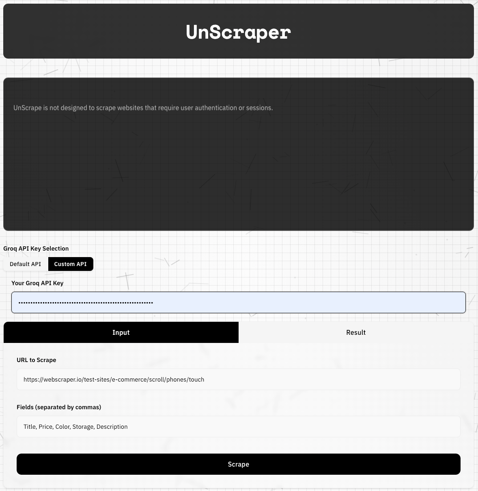
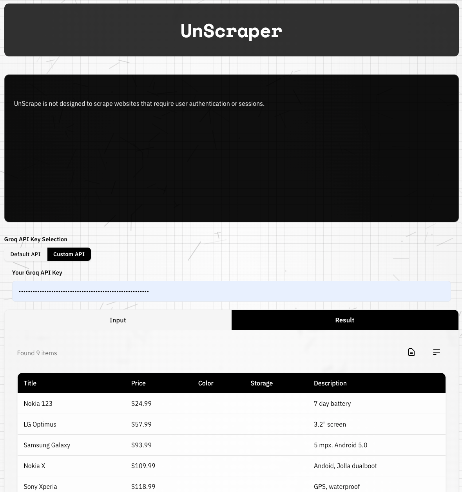

# UnScraper - Choose Your Frontend!

##### Django





##### Streamlit


## Table of Contents

* [Introduction](#introduction)
* [System Requirements](#system-requirements)
* [Features](#features)
* [Project Structure](#project-structure)
* [Choose Your Frontend](#choose-your-frontend)
* [Installation](#installation)
* [Running the Applications](#running-the-applications)
* [How to Scrape Websites](#how-to-scrape-websites)
* [Troubleshooting](#troubleshooting)
* [Known Issues](#known-issues)
* [License](#license)
* [Contact](#contact)

## Introduction

UnScraper is a web scraping tool that comes with TWO completely separate frontend implementations:

1. A Streamlit version - Perfect for data scientists and those who prefer Streamlit's interactive interface
2. A Django version - Ideal for those who prefer a traditional web application interface

Both versions offer the same core scraping functionality - you choose the interface that works best for you!

## System Requirements

For Streamlit Version:

* Python 3.8 or higher
* Streamlit 0.86.0 or higher
* Playwright 1.12.0 or higher

For Django Version:

* Python 3.11 or higher
* Django 4.0 or higher
* Playwright 1.12.0 or higher

## Features

Common Features (Both Versions):

* AI-powered web scraping
* Extract data without user authentication
* Support for CSS selectors
* Loading animations
* Groq API integration

Streamlit-Specific Features:

* Interactive data visualization
* Real-time updates
* Data science-friendly interface

Django-Specific Features:

* Traditional web interface
* Database storage
* Template-based rendering

## Choose Your Frontend

### Option 1: Streamlit Version

- Best for: Data scientists, analysts, and those who love interactive data apps
- Features: Real-time updates, interactive widgets, data visualization
- Startup: Single command to run

### Option 2: Django Version

- Best for: Web developers and those who prefer traditional web interfaces
- Features: Database storage, template-based views, web-app structure
- Startup: Standard Django development server

## Installation

1. Clone the repository:

   ```bash
   git clone https://github.com/YourUsername/UnScraper.git
   ```
2. Choose your preferred version:

   For Streamlit:

   ```bash
   cd UnScraper
   python -m venv venv
   source venv/bin/activate  # or venv\Scripts\activate on Windows
   pip install -r requirements.txt
   ```

   For Django:

   ```bash
   cd UnScraper
   python -m venv venv
   source venv/bin/activate  # or venv\Scripts\activate on Windows
   pip install -r requirements.txt
   python manage.py migrate
   ```

## Running the Applications

### To Run Streamlit Version:

```bash
cd UnScraper
streamlit run main.py
```

Access at: `http://localhost:8501`

### To Run Django Version:

```bash
cd UnScraper
python3 api.py
cd UnScraper_Django
python manage.py runserver
```

Access at: `http://127.0.0.1:8000`

## How to Scrape Websites

1. Create a Groq Account:

   * Navigate to: https://console.groq.com/keys
   * Register
   * Create a new API key
2. Choose your preferred interface:

   Using Streamlit:

   * Open the Streamlit app
   * Enter your Groq API key
   * Input URL and fields
   * Watch real-time results

   Using Django:

   * Open the Django web interface
   * Enter your Groq API key
   * Input URL and fields
   * View results on the results page

## Troubleshooting

Streamlit Version:

* Check Streamlit console output
* Verify Streamlit installation
* Check for port 8501 conflicts

Django Version:

* Check Django debug output
* Verify database migrations
* Check for port 8000 conflicts

## Known Issues

* Some websites block automated scraping
* Advanced anti-scraping measures may prevent extraction
* Each version runs on different default ports

## License

Both versions of UnScraper are licensed under the MIT License. See the [LICENSE](LICENSE) file for more information.
