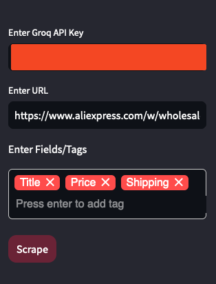
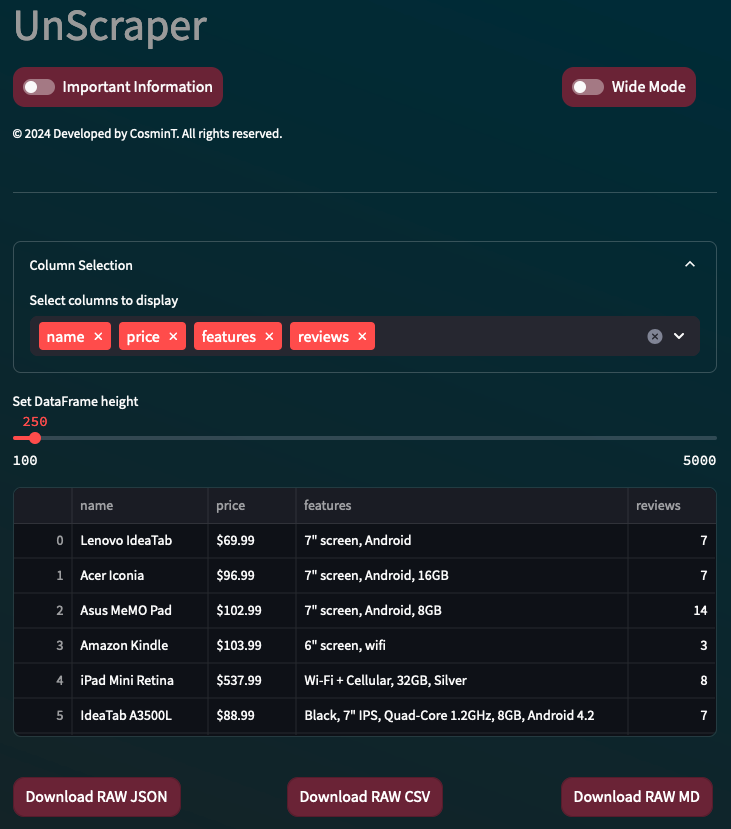

# UnScrape App README

## Table of Contents

---

* [Introduction](#introduction)
* [System Requirements](#system-requirements)
* [Features](#features)
* [Installation](#installation)
* [Usage](#usage)
* [How to Scrape Websites](#how-to-scrape-websites)
* [Troubleshooting](#troubleshooting)
* [Known Issues](#known-issues)
* [License](#license)
* [Contact](#contact)

## Introduction

---

UnScrape is a web data extraction tool that integrates AI technology with established scraping methods. It retrieves information from websites without needing user credentials or active sessions, employing HTML parsing and CSS selectors. UnScrape's distinguishing feature is its AI-driven ability to convert scraped content into organized tables, streamlining data analysis and manipulation for users.

## System Requirements

---

* Python 3.8 or higher
* Streamlit 0.86.0 or higher
* Playwright 1.12.0 or higher

## Features

---

* Extract data from websites without requiring user authentication or sessions
* Supports multiple CSS selectors for extracting data
* Features a loading animation for long-running scraping operations
* Includes a custom CSS style sheet for a dark mode interface
* Allows users to input a URL and fields/tags to scrape from the website

## Installation

---

To install the UnScrape app, follow these steps:

1. Clone the repository using `git clone https://github.com/Cosmin-T/Un-Scrape.git`
2. Navigate to the cloned repository directory using `cd Un-Scrape`
3. Create a new virtual environment using `python3 -m venv env`
4. Activate the virtual environment using `source env/bin/activate` (on Linux/Mac) or `env\Scripts\activate` (on Windows)
5. Install the required packages using `pip install -r requirements.txt`

## Usage

---

To run the UnScrape app, follow these steps:

1. Navigate to the cloned repository directory using `cd UnScrape`
2. Activate the virtual environment using `source env/bin/activate` (on Linux/Mac) or `env\Scripts\activate` (on Windows)
3. Run the app using `streamlit run UnScrape.py`

Once the app is running, you can input a URL and fields/tags to scrape from the website.

## How to Scrape Websites

---

To scrape a website using the UnScrape app, follow these steps:

1. Input the URL of the website you want to scrape in the `URL` input field.
2. Input the fields/tags to extract from the website in the `Fields/Tags` input field.
3. Click on the `Scrape` button to start the scraping operation.
4. Wait for the scraping operation to complete (this may take a few seconds or minutes, depending on the complexity of the website).

## Troubleshooting

---

If you encounter any issues while running the UnScrape app, try the following:

* Check the console logs for any error messages
* Make sure the website you are trying to scrape is not blocking the app's requests
* Check the app's configuration files for any typos or misconfigurations

## Known Issues

---

* The app may not work correctly with websites that use heavy JavaScript or dynamic content
* The app may not work correctly with websites that block requests from unknown IP addresses
* The app may not work correctly with websites that use advanced anti-scraping measures

## License

---

The UnScrape app is licensed under the MIT License. See the [LICENSE](LICENSE) file for more information.
